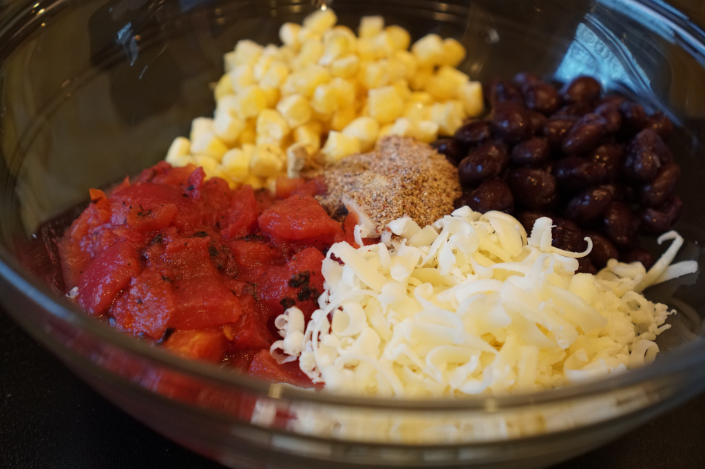

Time: 50 minutes; Makes 2 servings

* 1 cup quinoa
* 1/2 cup corn
* 1/2 cup black beans, drained and rinsed
* 1/2 cup fire roasted diced tomatoes
* 2/3 cup shredded Monterey Jack cheese
* 1 tsp chili powder
* 1/2 tsp cumin
* 1/2 tsp garlic powder
* 1/2 tsp onion powder
* salt and pepper to taste
* 2 bell peppers, tops cut, stemmed and seeded
* 1-2 tbsp chopped cilantro, optional

Cook quinoa on the stove top according to package directions. While quinoa cooks, prepare the filling (corn, beans, tomatoes, cheese and spices) in a large bowl and heat oven to 350.

Once quinoa is cooked and fluffy, mix together with the filling.

Spoon the filling into each bell pepper cavity. Place bell peppers on a baking sheet lined with aluminum foil or parchment paper (helps with cleanup!).  Bake for 25-30 minutes and serve immediately.

Top with salsa, sour cream or guacamole if desired.

_The recipe for these Quinoa Stuffed Peppers was inspired by_ [_Damn Delicious_](https://damndelicious.net/2013/06/03/quinoa-stuffed-bell-peppers/)_._
